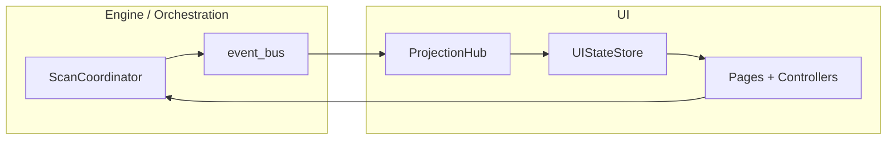

# Architecture review (formalized)

## Data flow

1. **`CerebroApp` (`ui/app.py`)** owns `Tk`, `ScanCoordinator`, `ProjectionHub`, `UIStateStore`, and `ProjectionHubStoreAdapter`.
2. **Events** flow `coordinator.event_bus` → `ProjectionHub` → store adapter → **`UIStateStore`**.
3. **Pages** read store via `attach_store` / selectors where migrated; **controllers** (`ScanController`, `ReviewController`) send intents and update store.
4. **Rule:** `dedup/engine` and `dedup/orchestration` do **not** import `dedup.ui` (verified by grep, Phase 1).

## Component hierarchy

- **Shell:** `AppShell` → `TopBar`, `NavRail`, `InsightDrawer`, `StatusStrip`, `GradientBar`.
- **Pages:** Mission, Scan, Review, History, Diagnostics, Settings, **Themes** (Phase 2).
- **Shared UI:** `ui/components/*` (e.g. `SafetyPanel`, `EmptyState`, `SectionCard`, `ReviewWorkspaceStack`).

## Performance notes (known)

- Large scans materialize file lists in memory; Review navigator capped (`REVIEW_NAVIGATOR_MAX_ROWS`).
- **Virtual tree / virtualization:** Not implemented — see Phase 4 skip list in `docs/PHASE_ROLLOUT.md`.
- Benchmarks: `engine/bench.py`, baseline doc `docs/BENCHMARK_BASELINE.md`.

## Accessibility & “responsive”

- **Tkinter desktop:** “Responsive” = min window size, grid weights, max content width (`AppShell.MAX_CONTENT_WIDTH`).
- **WCAG:** Contrast helpers added in `dedup/ui/theme/contrast.py` (Phase 2); full AA pass **planned** Phase 7.
- **Keyboard:** Global shortcuts registered via `ShortcutRegistry` (Phase 3) plus Review-specific binds in `ReviewPage`.

## Diagram (logical)

