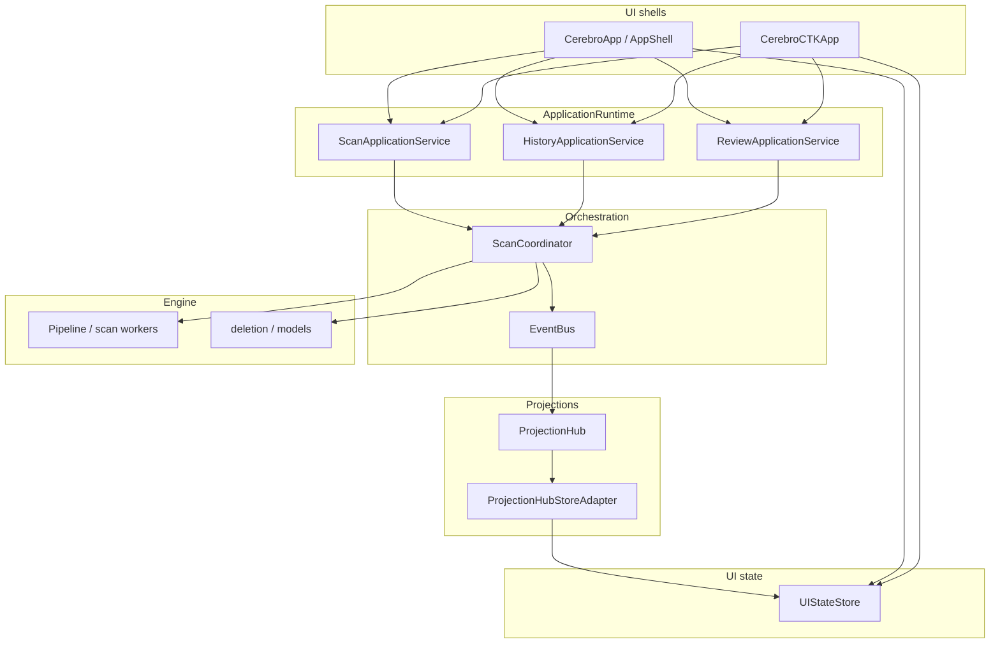

# UI architecture (desktop shells)

High-level data flow for **CEREBRO** ttk (`CerebroApp`) and CustomTkinter (`CerebroCTKApp`) shells. Both share the same orchestration contracts: one `ScanCoordinator`, `ApplicationRuntime` facades, `ProjectionHub`, and `UIStateStore`.

**Contracts**

- **Hub:** Delivers frozen projection snapshots on the Tk main thread; UI widgets must not subscribe to the raw `EventBus`.
- **Store:** Canonical cross-page state (`scan`, `review`, `mission`, `history`, `ui_mode`, `ui_degraded`).
- **Controllers:** `ScanController` / `ReviewController` call services (not pages) for start/cancel/delete intents.

For boundary detail, see [BOUNDARY_AUDIT.md](BOUNDARY_AUDIT.md).
